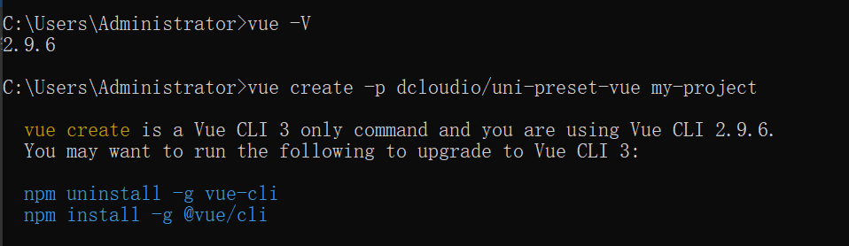

> 由DCloud打造的一套使用 Vue.js 开发所有前端应用的框架。于2015年8月推出**流应用**。
> 开发者编写一套代码，可发布到iOS、Android、Web（响应式）、以及各种小程序（微信/支付宝/百度/头条/QQ/快手/钉钉/淘宝）、快应用等多个平台。

**_Tips_**：以下内容以HBuilderX3.4.7为示例版本

# 1. 思考

1. 跨端适配？
2. Vue生命周期在uni-app中兼容吗？
3. 优/缺点
4. 类似框架的对比（taro）

# 2. 安装

## 2.1 通过HBuilderX安装

详细流程可参考：[https://uniapp.dcloud.io/quickstart-hx.html#%E5%8F%91%E5%B8%83uni-app](https://uniapp.dcloud.io/quickstart-hx.html#%E5%8F%91%E5%B8%83uni-app)

## 2.2 通过vue-cli安装

未安装vue时：

```powershell
npm install -g @vue/cli@4 /* 全局安装* /
npm install @vue/cli@4 /* 局部安装* /
```

- 正式版（对应HBuilderX最新正式版）

```powershell
vue create -p dcloudio/uni-preset-vue my-project
```

- alpha版（对应HBuilderX最新alpha版）

```powershell
vue create -p dcloudio/uni-preset-vue#alpha my-alpha-project
```

### 2.2.1 vue版本较低时



### 2.2.2 vue版本过高时

版本过高会导致启动报错，需查看HBuilderX对应的NPM版本，修改依赖为指定版本，或安装指定vue-cli版本。

# 3. 发展历程

- 2012年DCloud开始研发微信小程序，优化webview功能和性能，加入联盟，推出HBuilder工具
- 2015年DCloud正式商用自己的小程序，称为“流应用”，非B/S模式的轻应用，是能接近原生功能，即点即用
- 2016年，微信决定上线小程序业务，没有接入联盟标准，定制了自己的标准

# 4. 目的

每个端有每个端的规则，其目的便是为了抹平各平台之间的差异

# 5.核心

Vue.js语法 + 小程序API + 条件编译能力

- Vue.js 的语法在微信小程序端，uni-app是通过编译器 + 运行时增强实现，在H5端则默认支持；
- 而小程序的API，其实包括三个部分：框架 + 组件（UI）+ 接口（API），这三部分在微信小程序端是内置支持的，而uni-app若要发布到H5平台，则需完整模拟实现小程序运行时环境。

# 6. 目录结构

```markdown
|——pages         //业务页面文件
  |——index.vue   //index页面
|——static      //静态资源文件
|——App.vue     //应用配置，用来配置APP全局样式及监听
|——index.html    //html页面
|——main.js     //vue初始化文件
|——mainfest.js   //配置应用名称、appid、logo等打包信息
|——pages.json    //配置文件，路由、导航条、选项卡等
|——uni.scss     //uni-app内置样式变量
```

# 7. 生命周期

除了支持 Vue 的生命周期外，还支持应用生命周期及页面生命周期

## 7.1 应用生命周期

所有页面都在 App.vue 下进行切换，是页面入口文件
作用：调用应用生命周期函数、配置全局样式、配置全局存储 globalData

```json
<script>
 export default {
  // 非应用生命周期无法监听，无效
  onLoad(){
   console.log('App load');
  },
  
  /* 应用生命周期 start */
  // 初始化完成时触发（全局只触发一次）
  onLaunch() {
   console.log('App Launch')
  },
  // 启动或从后台进入前台展示
  onShow() {
   console.log('App Show')
  },
  // 从前台进入后台
  onHide() {
   console.log('App Hide')
  },
  // 报错时触发
  onError() {
   console.log('onError')
  },
  // 页面不存在监听函数
  onPageNotFound() {
   console.log('onPageNotFound')
  },
  // 对未处理的Promise拒绝事件监听函数（2.8.1+）
  onUnhandledRejection() {
   console.log('onUnhandledRejection')
  },
  // 对nvue页面发送的数据进行监听
  onUniNViewMessage() {
   console.log('onUnhandledRejection')
  },
  // 监听系统主题变化
  onThemeChange() {
   console.log('onUnhandledRejection')
  }
  /* 应用生命周期 end */
 }
</script>
```

**_Tips：_**

- 应用生命周期仅可在 App.vue 中监听，在页面监听无效
- App.vue 不能写模板

**globalData**
简单的全局变量机制，在uni-app中全端通用
nvue的weex模式中使用时，由于weex生命周期不支持onShow（可以利用 webview 的 addEventListener show 事件实现onShow效果，或使用weex中的beforeCreate），因此建议使用uni-app编译模式，而不是weex。

```json
<script>
 export default {
  globalData: {  
    text: 'text globalData'  
  },
  onLaunch() {
   console.log('App Launch')
   console.log(this.globalData.text)
  },
 }
</script>

// 执行结果
18:17:51.604 App Launch at App.vue:10
18:17:51.610 text globalData at App.vue:11
```

## 7.2 页面生命周期

```json
<script>
 export default {
  //应用生命周期，无效，无法监听
  onLaunch() {
   console.log('pages onLaunch')
  },
   
  /* 
  * 部分页面生命周期
  * 更多可见：https://uniapp.dcloud.io/tutorial/page.html#lifecycle
  */
  // 监听页面初始化 触发时机早于onLoad，仅支持百度小程序
  onInit() {
   console.log('pages onInit')
  },
  // 监听页面加载，用于页面传参
  onLoad(){
   console.log('pages onLoad');
  },
  // 监听页面显示
  onShow() {
   console.log('pages onShow')
  },
  // 监听首次渲染完成
  onReady() {
   console.log('pages onReady')
  },
  // 监听页面隐藏
  onHide() {
   console.log('pages onHide')
  },
 }
</script>
```

**_Tips：_**
**onInit：**

- 仅支持百度小程序3.1.0以上
- 不依赖页面传参的逻辑可直接使用created生命周期替代
- 多版本或多平台可以同时使用onLoad进行兼容，注意避免重复执行相同逻辑

# 8. nvue 开发与 vue 开发的常见区别

vue页面和nvue页面，均全平台支持，差异在于当uni-app发行到App平台时，vue文件会使用webview进行渲染，nvue会使用原生进行渲染。
可参考：[https://uniapp.dcloud.io/tutorial/page.html#template-block](https://uniapp.dcloud.io/tutorial/page.html#template-block)

# 9. 条件编译

用特殊的注释作为标记，在编译时根据特殊注释将代码编译到不同平台。

- #ifdef：仅在某平台下存在，判断条件仅有 ||
- #ifndef：除某平台外存在
- %PLATFORM%：平台名称（可取值：[https://uniapp.dcloud.io/tutorial/platform.html#preprocessor](https://uniapp.dcloud.io/tutorial/platform.html#preprocessor)）

```json
"pages": [
  // 默认第一个为启动页
  {
    "path": "pages/login/login",
    "style": { "navigationBarTitleText": "登录" }
  }, {
    "path": "pages/home/index",
    "style": { "navigationBarTitleText": "home" }
  }, 
 // #ifdef H5
 {
    "pagePath": "pages/user/user",
    "text": "user"
  }
  // #endif
],
```

**_Tips：_**

- 条件编译是利用注释实现的，不同语法写法不同，js使用 // 注释，css使用 /*注释*/，vue/nvue 模板使用 `<!-- 注释 -->`
- 使用条件编译要保证编译前后文件的正确性，如：json文件中不能有多余的都好，否则编译失败
- Vue 3 中需要在 manifest.json 文件中配置 ："vueVersion" : "3"
- iOS 和 Android 不支持通过条件编译区分，如需区分，可通过uni.getSystemInfo 来获取平台信息

# 10. 组件使用

内置组件使用可参考：[https://uniapp.dcloud.io/component/view.html](https://uniapp.dcloud.io/component/view.html)
扩展组件：

```powershell
// 安装 sass、sass-loader、uni-ui
npm i sass -D
npm i sass-loader@10.1.1 -D
npm i @dcloudio/uni-ui

// 配置easycom
// 根目录pages.json下添加easycom节点
{
 "easycom": {
  "autoscan": true,
  "custom": {
   // uni-ui 规则如下配置
   "^uni-(.*)": "@dcloudio/uni-ui/lib/uni-$1/uni-$1.vue"
  }
 },
 // 其他内容
 pages:[]
}
```

**_Tips：_**

- uni-ui 不支持使用 Vue.use() 的方式安装
- uni-ui 只推荐使用 easycom
- 扩展组件不包括内置组件，从性能来讲，按需引入扩展组件

# 11. 跨端注意

## 11.1 样式兼容

uni-app 支持通用 css 单位包括 px、rpx。

- px：像素
- rpx：响应式 px ，以750宽为基准，rpx 会随着屏幕宽度等比变化

### H5

支持 px、rpx、vw、vh、百分比、rem

### APP

- 不支持百分比、vh、vw、rem。

**_Tips：_**

- Vue2 不含 nvue
- 在 pages.json 中的 titleNView 或 plus api 中涉及的单位，只支持 px，不支持 rpx。

### 小程序

- px：以 750 宽的屏幕为基准动态计算的长度单位。weex 模式的 px 与 Vue 中的 px 逻辑不一样
- wx：与设备宽度无关

### rpx说明

设计稿1px与框架样式1rpx转换公式：设计稿1px /设计稿基准宽度 = 框架样式 1rpx /750rpx
宽度计算公式：750 * 元素在设计稿中的宽度 / 设计稿基准宽度
**_Tips：_**

- rpx受宽度影响，屏幕宽度越宽，该值实际像素越大。px不受屏幕宽度缩放
- rpx不支持动态横竖屏切换计算
- HBuilderX提供自动换算工具

# 12. 分包

## 12.1 相关概念

本质上是改变路由及优化项目各个模块启动时间的优化技术
主包：每个小程序初始化时所必须的一个主包（默认启动页）
分包：进入某个分包时，下载对应的分包完成后再展示

## 12.2 为什么需要分包

小程序默认主包下载，当主包体积过大时，会导致整个项目只有在全部加载完毕后才会展示。可使用加载动画进行优化，但从用户体验上来讲也存在用户流失的可能。
_**思考：除开微信限制之外，是否还有其他优点？**_
对小程序分包，可以优化首次启动时间，以及团队开发时的解耦协作
**_Tips：_**

- subPackages的pages路径是root下的相对路径，不是全路径
- 微信对每个单包限制在2MB，总体积一共不能超过20MB
- 分包下支持独立的static目录，用于对静态资源进行分包

## 12.3 分包方式

**配置 manifest.json：**
源码试图中在 mp-weixin 中设置开启分包优化

```json
  /* 小程序特有相关 */
  "mp-weixin" : {
    "appid" : "",
    "setting" : {
      "urlCheck" : false,
      "minified" : true
    },
    "optimization": {
      "subPackages": true // 开启分包优化
    },
    "usingComponents" : true,
  },
```

**修改 pages.json ：**

```json
"pages": [
  // 默认第一个为启动页
  {
    "path": "pages/login/login",
    "style": { "navigationBarTitleText": "登录" }
  }, {
    "path": "pages/home/index",
    "style": { "navigationBarTitleText": "home" }
  }, {
    "path" : "pages/user/user",
    "style" : { "navigationBarTitleText": "user" } 
  }
],
"subPackages": [{
  "root": "pagesOther",  // 分包名称
  "pages": [
    {
      "path": "personal/message",
      "style": { "navigationBarTitleText": "消息" }
    }
  ]
}],
```

**分包预载配置（preloadRule）：**
目的：优化速度，不想优化可无需配置
在 pages.json 添加 preloadRule 配置。

- packages：进入页面后加载指定分包，必填，无默认值，_APP_表示主包
- network： 指定网络下预下载，all（不限）、wifi（仅wifi），默认：wifi

```json
"preloadRule": {
 "pages/home/home": {
  "network": "all",
  "packages": ["pagesOther"]  
 }
},
```

## 12.4 打包原则

- 声明 subpackages 后，将按 subpackages 路径进行打包，subpackages 配置路径外的目录将被打包到主包中
- 主包可以有自己pages，即最外层 pages 字段
- subpackage 的根目录不能是另一个 subpackage 内的子目录
- tabBar 页面必须在主包内

## 12.5 引用原则

主包可以引用分包内文件，分包仅引用自身目录内文件，分包与分包间无法互相引用

# 13. 区别

数据截止时间：2022-05-20

|          | uni-app           | taro              |
| -------- | ----------------- | ----------------- |
| 技术栈   | Vue.js            | React.js          |
| 跨端程度 | H5、小程序、APP等 | H5、小程序、APP等 |
| 社区生态 | uni-ui            | taro-ui           |
| 云开发   | 所有平台          | 微信小程序        |
| 插件数量 | 6951              | 181               |
**_Tips：_**

- uni-app 使用上与 taro 类似
- 二者都需要注意跨端兼容

以上内容仅个人理解，如有错处或更多内容，欢迎大家指出和补充
